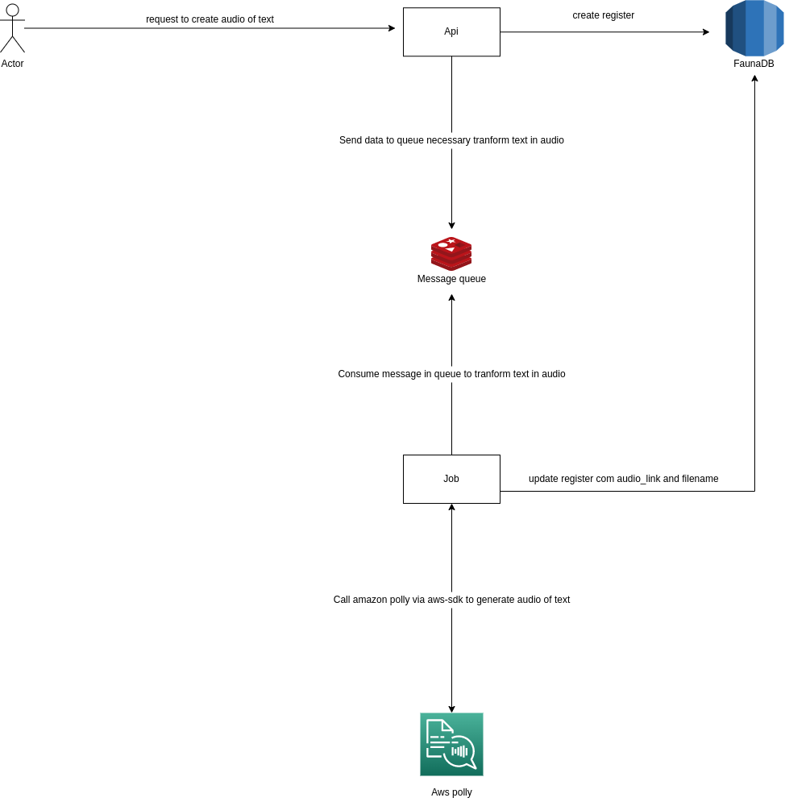

The project: is focus transform text to audio. Allow transform text that are: english or portuguese on audio files.

Technologies:
===============

- Node.js
- Javascript
- FaunaDB(database Nosql and serverless) this database purchase per interactions not time running and scale based volume demand query the database. 
- Amazon polly(service transform text to audio)
- S3(storage files)
- Bull + Redis(message queue)

Architecture:
==============

Instruction to run the project:
================================

- Clone project
- Create **.env** based in **.env.example** file
- Execute **npm install** to install modules necessary in project
- Execute **docker-compose up -d** to create container running redis, because redis is used here with message queue
- Execute **npm run start:dev** to run api on development mode or **npm run start** to run api production mode
- Execute **npm run jobs:dev** to run job to handler process text to audio on development mode or **npm run jobs** to run jobs on production mode
- Import **insominia.json** file in Insominia tool to simplify your test in api. The Insominia tool is way test your api where her work with http client equally the Postman